# UX / UI Flow Diagram

The diagram organizes the 15 forms into five lifecycle phases that map onto how a user's session actually unfolds.

**Bootstrap** runs once at startup. `frmSplash` is the engine — it reads `Config.txt`, validates the database file, runs migrations if the schema version is behind, and instantiates the Crystal Reports application. It detours to `frmDatabase` when there's no config or the file's missing, then back. Once everything is ready, control hands off to `frmUserLogin`. If the user's record has `ChangePassword = True`, login forwards them straight into `frmUserChangePassword` before letting them through — a forced reset they cannot bypass without quitting the app.

**Hub** is `frmDashboard`, the room grid. Every other form except print receipts and the password change either launches from here or returns to here. The F-key shortcuts (F2–F8) are the primary navigation; clicking a room button is the secondary path. Closing this form returns to login — there's no separate logout.

**Transactional** is the work users actually do. Three peer forms — `frmBooking`, `frmFindCustomer`, `frmReport` — all entered from the Dashboard and all returning to it on close. Each one knows how to refresh the Dashboard's room colors and summary counts on unload. `frmAdmin` was meant to gate Void operations from `frmBooking` but is currently a no-op stub; the disabled void path is shown dashed in red.

**Print** is `frmPrint`, the universal Crystal Reports viewer. Three forms feed it via globals (`gstrSQL`, `gstrReportFileName`, `gstrReportTitle`) — `frmBooking` for receipts, `frmFindCustomer` for transaction history, `frmReport` for the catalog reports. The print form opens its own database connection independent of the rest of the app, which is why it can show a long-running report while the operator continues elsewhere.

**Admin tools** are the four CRUD editors gated by separate `MOD_*` permissions. `frmReportMaintain` is unusual — it's reachable via the Ctrl+E expert path inside `frmReport` rather than directly from the Dashboard, so editing reports requires going through the report viewer first. `frmRoomTypeMaintain` is similarly nested — only reachable via Ctrl+T from `frmRoomMaintain`, never directly from the Dashboard. So the admin hierarchy is actually two-deep in places.

**Self-service** is `frmUserChangePassword`. The same form serves both forced (from login) and voluntary (F8 from Dashboard) flows, with the global `gblnUserChangePassword` flag distinguishing them. On the forced path, hitting Cancel terminates the application; on the voluntary path, Cancel returns to the Dashboard. One form, two completely different UX outcomes.

The structural insight is that the app is a single-spoke design: Dashboard sits at the center, everything else is a leaf, and there's no cross-traffic between leaves. You can't go from the Booking form to the Customer search form directly — you have to return to the Dashboard first. Combined with the frequent `Form_Unload → frmDashboard.Show` pattern, this gives the system a strict hub-and-spoke shape that's easy to reason about but also means common cross-form workflows (look up a customer, then check their last booking, then book them a new room) involve more navigation steps than they could.
