# Data Flow Diagram

The diagram organizes the system into six layers and one side channel. Reading top to bottom traces what happens when a user does anything that touches the database, from the moment they click to the moment a row comes back.

**User input** is the trigger — clicking a room button, pressing F3, typing into a textbox, hitting Save. Every event in VB6 lands in a Form's event handler.

**Presentation** is the form layer. Each handler does three things in roughly this order: validate inputs, check permissions via `UserAccessModule(MOD_X)`, and then build a SQL query. The form layer is also where session globals (`gstrUserID`, `gintUserGroup`, `gstrCompanyName`) get displayed to the user — labels, captions, status bars all read from `modGlobalVariable`.

**Business helpers** live in `modFunction`, `modEncryption`, and `modCommon`. This is the layer that answers domain questions: "is this user an admin?", "do they need to change their password?", "what's the encrypted form of this password?", "what's a safe-typed integer from this Variant?". The form layer calls down to these for any logic that's reused across forms.

**SQL builder** is where the architectural defining choice of the codebase lives. The form code calls a sequence of `SQL_SELECT`, `SQL_FROM`, `SQL_WHERE_*`, `SQL_SET_*`, `SQLData_*` subs — each one **mutates the global string `gstrSQL`**. The amber box in the middle is that global. By the time the form is done calling the builder family, `gstrSQL` holds a complete SQL statement ready to execute. This is the bottleneck that prevents parallel queries and the fragility that makes comma-management bugs possible. Everything else above and below this layer is normal-shaped code; the SQL builder is unique to this codebase.

**Connection layer** is `modDatabase`. `OpenDB` opens the Jet 4.0 connection using the obfuscated password from `GenWord` ("Computerise"). Then the form chooses between two paths: read-shaped queries go through `OpenRS`/`OpenSQL` and return an `ADODB.Recordset` for iteration; write-shaped queries (INSERT/UPDATE/DELETE) go through `QuerySQL` which wraps the execution in a single-statement transaction.

**Storage** is the .mdb file itself — Microsoft Access 2000-format database, password-protected with the obfuscated string. The two-way arrow at the bottom shows that data flows both ways: the forms write rows in (bookings, payments, user changes) and read rows out (room status, customer history, reports).

**Side channels** are the two error-logging paths. Most code paths use `LogErrorDB` to write into the `LogError` table — same database, same connection. But certain low-level code (the connection helpers themselves, the encryption module, anything that runs before the database is open) can't depend on the database being available. Those paths fall back to `LogErrorText`, which writes to a flat `Error.txt` file in `App.Path`. The fallback exists specifically so connection failures can still be recorded.

A few things the diagram doesn't show but are worth knowing about the actual flow:

The system is **strictly synchronous and single-threaded** — every layer blocks the UI thread until it returns. There's no async pattern, no background workers, no progress indicators for long operations. A complex report query that takes several seconds freezes the entire UI while it runs.

The **transaction boundary is per query, not per business operation**. So a multi-step save (write to Booking, then INSERT into LogBooking, then UPDATE Room status) is *not* atomic by default — each `QuerySQL` call gets its own transaction. To make multi-step operations atomic, the form would need to call `ACN.BeginTrans` itself before the sequence and `CommitTrans` after. Looking back at the form analyses, this is **not done anywhere** — every multi-step save in `frmBooking`, `frmRoomMaintain`, etc. relies on per-statement transactions and accepts the small risk of a partial save if the system crashes mid-sequence.

The **permission check happens at form-load time, not per operation**. So if an admin disables a user's "Edit Report" permission while that user is already inside the Report form, the user can still complete actions until they navigate away and come back. There's no mid-session permission re-check.

The **`CrApplication` (Crystal Reports) path bypasses this layer cake entirely**. When `frmPrint` opens, it loads a `.rpt` template through Crystal's own ActiveX runtime, then pushes a recordset that was prepared by the calling form. So Crystal does its own database work in parallel with this stack — separate connection, separate query, separate cursor. The diagram could include a parallel Crystal stack but it would clutter the main flow.

If you'd like, the next diagram could focus on **a specific transaction's lifecycle** — for example, "what exactly happens when a clerk checks in a guest?" — showing the sequence of validations, queries, and updates that ripple through the system for that one operation. That would complement this layer-cake view with an end-to-end timeline.
